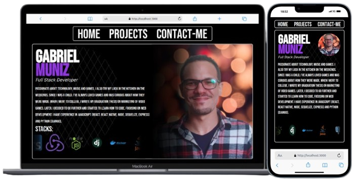
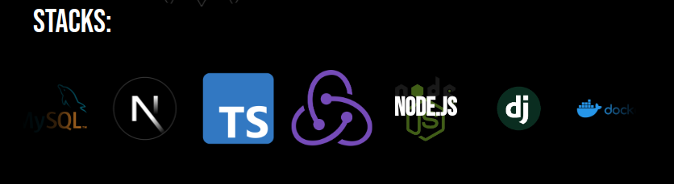
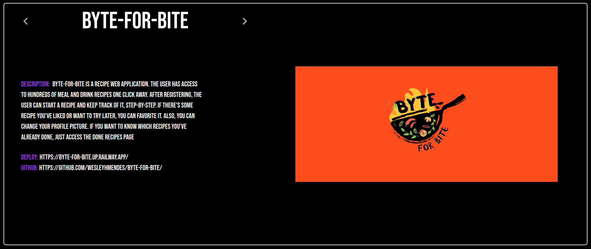
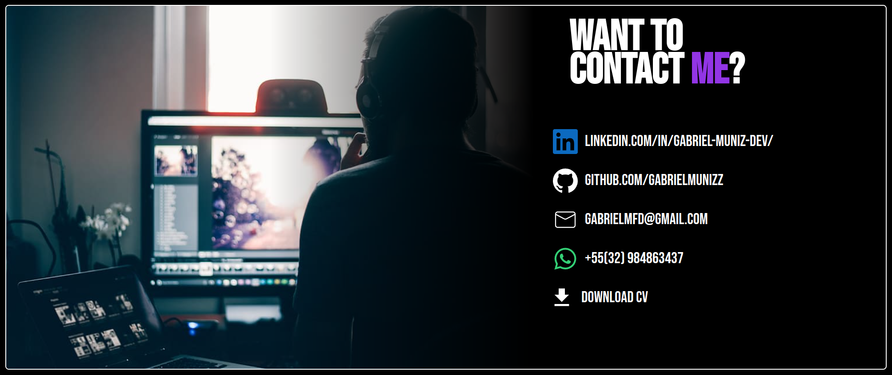

# Portfólio

## Sobre o portfólio:



Este portfólio foi desenvolvido com as seguintes tecnologias:

- **Next.js**: Para uma experiência de navegação rápida e eficiente.
- **Tailwind CSS**: Para estilização customizada e responsiva.
- **Framer Motion**: Para animações suaves e interativas.

O portfólio inclui:

- Barra de navegação com três seções: **Home**, **Projects**, e **ContactMe**.
- **Home**: Página principal onde tem um breve resumo sobre mim e as stacks que domino.
- **Projetos**: Uma lista de projetos com links para o repositório, deploy e uma thumbnail de cada projeto.
- **ContactMe**: Links diretos para meu LinkedIn, GitHub, WhatsApp, e-mail e um botão para download do currículo.
- **Stacks**: Um carrossel de stacks que desacelera ao passar o mouse sobre as stacks.

---

## Estrutura do Portfólio

### **Home**

A página inicial traz uma introdução sobre mim e um **Stacks Carousel** animado utilizando o Framer Motion. Quando o usuário passa o mouse sobre uma stack, o carrossel desacelera, destacando o nome da tecnologia que está em foco.

- **Tecnologias exibidas**: React, Node.js, Django, TypeScript, Java, Docker, MySQL, PostgreSQL, Redux e etc.
- **Animação**: Criei uma experiência interativa com animação suave ao passar o mouse sobre as stacks.



---

### Projects

Nesta seção, exibo os projetos que já desenvolvi, com uma breve descrição, links para o repositório no GitHub, deploy, e uma thumbnail ilustrando cada projeto.



---

### ContactMe

Na página de contato, há links diretos para as minhas redes profissionais e um botão de download para o meu currículo em PDF.

Lista de links disponíveis:

- [**LinkedIn**](https://www.linkedin.com/in/gabriel-muniz-dev/)
- [**GitHub**](https://github.com/GabrielMunizz)
- [**Whatsapp**](https://api.whatsapp.com/send?phone=5532984863437)
- [**E-mail**](mailto:gabrielmfd@gmail.com)
- **Download do Currículo**: Um botão que baixa o meu currículo atualizado.



---

## Tecnologias Utilizadas

- **Next.js**: Framework de React que permite criação de aplicações web rápidas com renderização do lado do servidor (SSR).
- **Tailwind CSS**: Framework utilitário para construir interfaces rápidas e responsivas.
- **Framer Motion**: Biblioteca de animações para React.

---

## Como Executar o Projeto Localmente

1. Clone este repositório:

```jsx
git clone https://github.com/GabrielMunizz/portfolio2.git
```

1. Entre na pasta do projeto:

```jsx
cd portfolio2
```

1. Instale as dependências:

```jsx
npm install
```

1. Execute o projeto:

```jsx
npm run dev
```

1. Abra o navegador em:

```jsx
http://localhost:3000
```